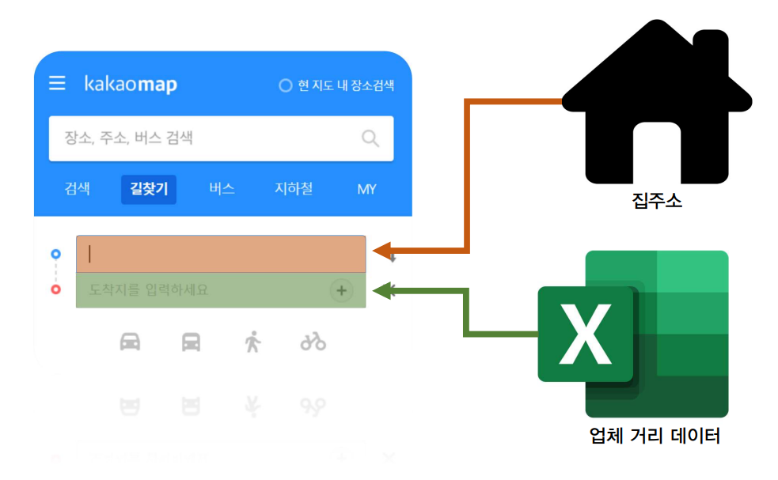
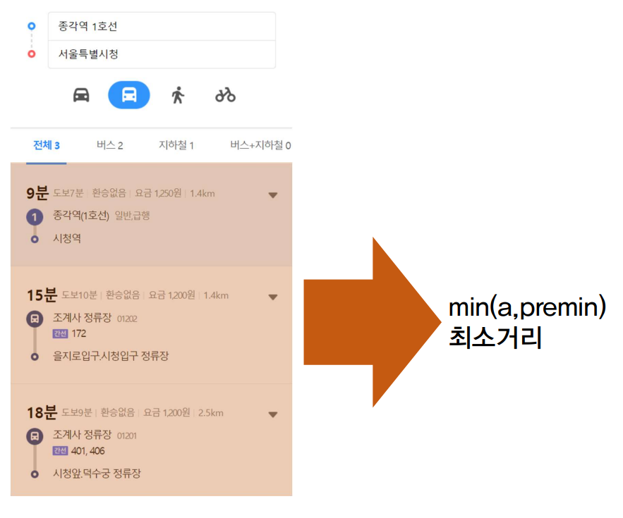

## 집->회사 거리 교통 계산


본 프로젝트는 무수히 많은 회사 데이터를
전수조사 할때 인간의 힘으로 해내기 힘들다 판단해
**카카오 지도 서비스와 Python**을 이용한 

데이터 추출 프로젝트입니다.

---

### 사용한 모듈


---

### 프로그램 흐름 Flow

#### 1. 입력



* 상단에는 START_ADD에 입력한 출발지를 입력한다.
    ```py
    KAKAO_URL = "https://map.kakao.com/"
    START_ADD = "집 이름 넣기"
    ```
* 하단에는 CSV 파일을 pandas로 DF로 가공해 업체 데이터 입력
  ```py
  dataBase = pd.read_csv('20220212.csv', encoding="UTF-8")
  ```
  
    ```py
    for i in dataBase["주소"]:
    if(cnt > len(savedFile["거리"])):
        # https://rfriend.tistory.com/482
        onlineData = pd.DataFrame.from_dict([{"주소": i, "거리": SearchDest(i)}])
        # https://freedata.tistory.com/53
        collectedData = pd.concat(
            [collectedData, onlineData], ignore_index=True)
        pd.DataFrame(data=collectedData, columns=["주소", "거리"]).to_csv(
            "distFile.csv", header=True)
    cnt += 1
    ```

#### 2. 파싱과 계산



* 결과중 대중교통 결과중 최소거리를 리턴한다.
    ```py
    if(len(timeList) < 1):
        return int(999)
    else:
        return min(timeList)
    ```

### 결론

* 1000개가 넘는 회사를 대상으로 
필자의 집과 회사간 거리를 오름차순 정렬하여 
거리순으로 오름차순 정렬할 수 있는 기틀을 마련했다.